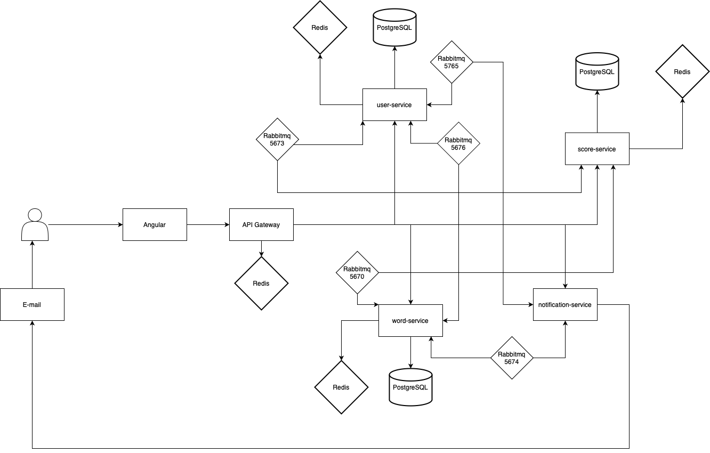

# FluentWeb
An English learning app that helps you remember words.

## Try the App 
🔗 See live version: https://fluentweb.pl

## 🚀 Technologies  

### 🎨 Frontend  
- **Angular**  

### ⚙️ Backend  
- **Spring Boot Microservices:**  
  - 🧑‍💻 `user-service`  
  - 📖 `word-service`  
  - 🏆 `score-service`  
  - 🔔 `notification-service`  
  - 🚪 `gateway`  
  - 🗺 `eureka`  

### 🗄 Database  
- **PostgreSQL**  
- **Redis**  
- **LiquiBase**  

### 🔒 Security  
- **JWT tokens (RS256)**  

### 📡 Messaging  
- **RabbitMQ** (communication between microservices)  

### ☁️ Hosting  
- **VPS Contabo**  

### 🧪 Tests  
- **JUnit 5**
- **Unit and integration tests**

### 🔄 CI/CD
- ***GitHub Actions** (automatic build of docker image)
### 🛠 Tools  
- **Docker, Docker-compose, Nginx**  
- 🐍 **Python script** (to adding words)

## Features
### Users
- **Learning new words:** Users can learn new English words in the "Lesson" tab.
- **Repetition of words:** Users can review words using the 'SuperMem' algorithm to help with memorization.
- **Score:** For each correct given words, user earn points depends on word's cerf level (A1, A2, B1, B2, C1, C2)
- **Ranking:** Users can compete with each other and view the top 20 users, as well as their own position on the list.
- **Podium:** The top three users will be featured on the podium.
- **Sending Daily Statistic:** Every day at 12PM, users will receive an email with their daily statistic.
- **User Forget Me:** Users can request to be forgotten. When they do, their data will be deleted, and their JWT token will be added to a blacklist in Redis. Additionally, their email (hashed) will be stored in the **blacklisted users table**, ensuring they cannot be re-registered with the same email.
### Admin
- **Words:** As an admin I can add, edit and delete words from the admin panel.
- **Users**  As an admin I can manage user data and ban users from the admin panel.

## System Architecture

Below is a diagram of the dependecies between the system components

